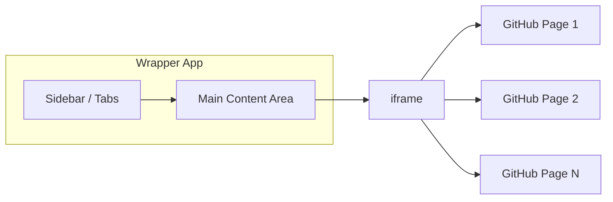

# Micro Frontend Wrapper for Multiple GitHub Pages

## Approach

- **Shell**: Single-page app with a fixed sidebar (or top tabs) and a main content area.
- **Embedding**: Each “app” is a GitHub Page loaded in an iframe when its tab/link is selected.
- **Stack**: Vanilla HTML, CSS, and JavaScript—no build step, easy to deploy to GitHub Pages.

## High-level architecture




- User picks an item in the sidebar → script sets the iframe `src` to that GitHub Page URL and marks the active tab.
- Only one iframe is used; switching tabs just changes its `src`.

## File structure

```
micro-front-end/
├── index.html          # Shell: sidebar + iframe container
├── styles.css          # Layout and sidebar/tab styling
├── app.js              # Tab click handling, iframe src updates, active state
└── config.js           # List of GitHub Page names and URLs (easy to edit)
```

- **config.js**: Export an array of `{ id, label, url }` for each GitHub Page (e.g. `https://username.github.io/repo-name/`). You add/remove entries here.
- **index.html**: Semantic structure: nav/sidebar with buttons or links, and a single `<iframe>` in the main area. Scripts: `config.js`, then `app.js`.
- **styles.css**: Flexbox or grid so sidebar has fixed width, iframe fills the rest; optional responsive behavior (e.g. collapse sidebar on small screens).
- **app.js**: On load, build sidebar from config; on item click, set iframe `src` to the chosen URL and update active state (e.g. class on the clicked item).

## Implementation details

1. **index.html**
  - Sidebar: `<nav>` with a `<ul>` or divs; `app.js` will populate it from config.
  - Main: one `<iframe>` with a predictable id (e.g. `main-frame`), optional `title` for a11y.
  - No hardcoded GitHub URLs in HTML; all come from `config.js`.
2. **config.js**
  - Simple structure, e.g.:
  - You replace these with your real GitHub Page URLs.
3. **app.js**
  - Read `GITHUB_PAGES`, create a sidebar item per entry (button or link with `data-url` or stored in closure).
  - Click handler: set `iframe.src` to the selected URL, remove “active” from all items, add “active” to the clicked one.
  - Optional: set first entry as default (load its URL in the iframe on first load).
4. **styles.css**
  - Layout: sidebar (e.g. 200px width) + main area (flex-grow) so the iframe fills remaining space.
  - Iframe: `width: 100%; height: 100%; border: 0;` (and ensure parent has a defined height, e.g. `height: 100vh` or flex).
  - Style the active tab (e.g. background or border) so it’s clear which GitHub Page is shown.

## Shared theme (profile, cv-builder, host)

Theme is stored in **localStorage under one key** so profile, cv-builder (cv-generator), and the host stay in sync.

- **Key**: `mfTheme` (defined as `THEME_STORAGE_KEY` in `config.js`). Use this same key in profile and cv-builder when reading/writing theme.
- **Values**: `'light'` | `'dark'`.
- **Host**: On load the shell reads `localStorage.getItem('mfTheme')`, applies `data-theme` on `<html>`, and shows a theme toggle. When the iframe loads, the host sends `postMessage({ type: 'THEME', payload: 'light'|'dark' })` so the embedded app can apply the theme.
- **Profile / cv-builder**: On load, read theme from `localStorage.getItem('mfTheme')` and set `document.documentElement.setAttribute('data-theme', value)`. Listen for `message` events with `event.data.type === 'THEME'` and apply `event.data.payload`. When saving theme in your app, use `localStorage.setItem('mfTheme', 'light'|'dark')` so the host and other apps stay in sync. You can use `theme-helper.js` as a drop-in script.

## Optional enhancements

- **Deep linking**: Use `?page=id` in the wrapper URL; on load, read query string and load the matching GitHub Page and set active tab.
- **Responsive**: On narrow viewports, show a hamburger button that toggles sidebar visibility so the iframe still gets full width when needed.
- **Loading state**: Show a simple “Loading…” overlay when changing `iframe.src` and hide it on iframe `load` (optional; be aware of cross-origin iframe load detection).

## Deployment

- Push the repo to GitHub, enable GitHub Pages (e.g. “Deploy from main branch, /root or /docs”).
- Your wrapper will be at `https://<username>.github.io/micro-front-end/` (or your repo name). Opening it will show the sidebar and the first GitHub Page in the iframe.

## Summary


| Item        | Choice                                                               |
| ----------- | -------------------------------------------------------------------- |
| Integration | iframe per GitHub Page (one iframe, `src` switched by tab)           |
| UI          | Shell with sidebar/tabs                                              |
| Stack       | Vanilla HTML/CSS/JS                                                  |
| Config      | `config.js` with array of `{ id, label, url }` for your GitHub Pages |


You only need to add your real GitHub Page URLs in `config.js` and, if you want, tweak labels and order. No build step or framework required.